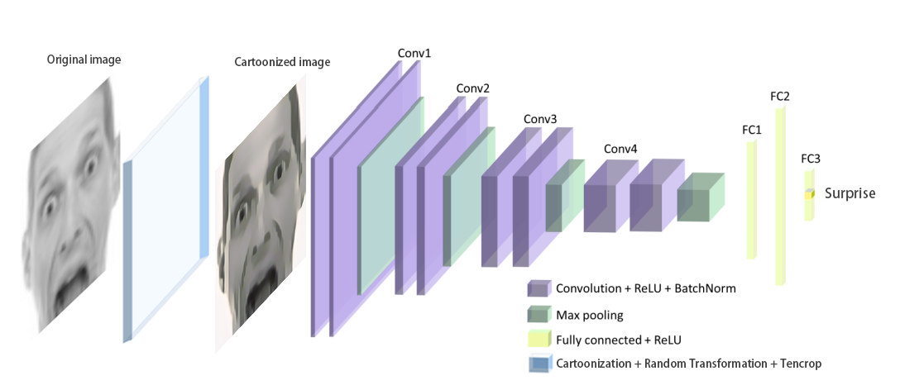

## Facial Image Emotion Recognition Based On Cartoonized Features (FER-Cartoon)

This is the final project for SJTU JI ECE4880J.

Our final model checkpoint can be found [here](https://drive.google.com/file/d/1TdNEAs2DpYMAdkC6aJfbgUeoqwbC0UzC/view?usp=sharing), you can place it under `checkpoints/`

### Overview
In this work, we present a method on facial image emotion
recognition by combining cartoonization and VGGNet. By
applying cartoonization as preprocess to images, we can
reduce unrelated facial features which often appear in traditional CNN method in facial emotion recognition task, such as wrinkles and freckles. To the best of our knowledge, our model achieves top 3 total classification accuracy on FER2013 dataset in single network, and achieves best accuracy on surprise and disguist class in top 3 approaches. By examining saliency maps, we further prove that cartoonization has positive effect on emotion recognition by reducing unrelated features in facial images.


### Architecture

### Installation
To use this repo, create a conda environment using `environment.yml` or `requirements.txt`

```
# from environment.yml (recommended)
conda env create -f environment.yml

# from requirements.txt
conda create --name <env> --file requirements.txt
```
The cartoonized fer2013 dataset can be downloaded [here](https://drive.google.com/file/d/12ZPBXaCtoVORT1ioeSl7RoCXHKglIlCe/view?usp=sharing), you need to place it in the following folder: 

`datasets/fer2013/fer2013_cartoonized.csv` 

### Usage

To train your own version of our network, run the following

```
python train.py network=vgg name=my_vgg
```
To change the default parameters, you may also add arguments such as `bs=128` or `lr=0.1`. For more details, please refer to `utils/hparams.py`

### Testing

Please refer to `notebooks/Evaluation.ipynb` for testing.